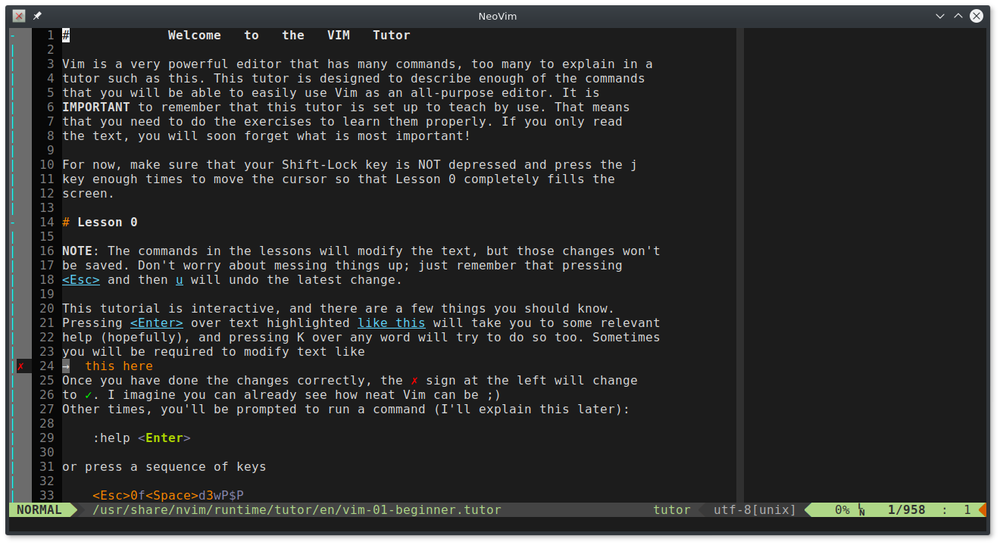

# Xterm-wrapper for NeoVim

executes neovim inside xterm for maximum usability and minimal footprint.

includes a .desktop file, so it can be launched from menus.

can be associated by filetypes (default-application).

### Requirements

NeoVim https://neovim.org

Xterm http://invisible-island.net/xterm/

### Installation
```
git clone https://git.jayvii.de/Scripts/NeoVim-Xterm
cd NeoVim-Xterm
chmod +x neovim-xterm
sudo cp neovim.svg /usr/share/pixmaps/neovim.svg
sudo cp neovim-xterm.desktop /usr/share/applications/neovim-xterm.desktop
sudo cp nvim-xterm /usr/bin/nvim-xterm
```

### Configuration

**xterm-appearance**

- either edit the `nvim-xterm` and set your configs in there accordingly

- or comment out all configs in `nvim-xterm` and configure it via `~/.Xdefaults`

**neovim-appearance**

- check out my [dot-files](https://git.jayvii.de/dotfiles/nvim) or create your own.

### Screenshot

